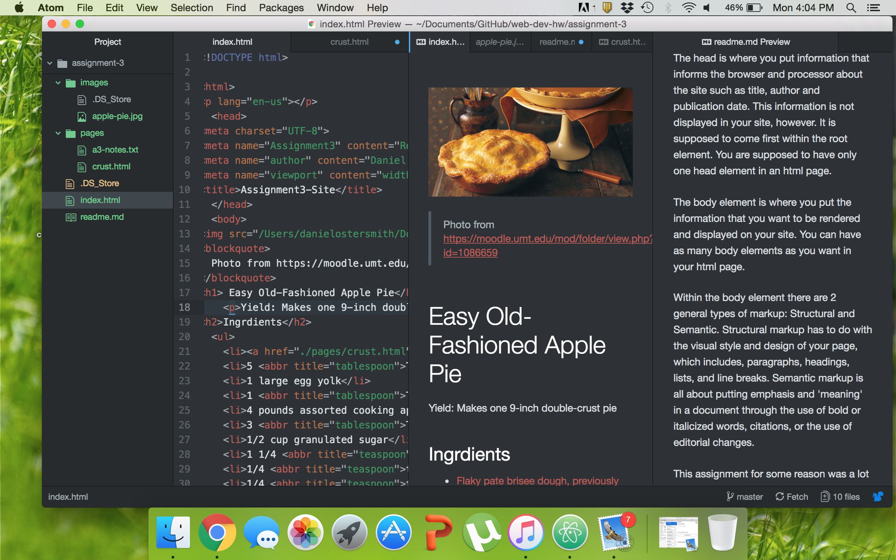

<h1>Technical Report</h1>
<body>
  

  The head is where you put information that informs the browser and processor about the site such as title, author and publication date. This information is not displayed in your site, however. It is supposed to come first within the root element. You are supposed to have only one head element in an html page. The body element is where you put the information that you want to be rendered and displayed on your site. You can have as many body elements as you want in your html page.

  
Within the body element there are 2 general types of markup: Structural and Semantic. Structural markup has to do with the visual style and design of your page, which includes, paragraphs, headings, lists, and line breaks. Semantic markup is all about putting emphasis and 'meaning' in a document through the use of bold or italicized words, citations, or the use of editorial changes.

  
This assignment for some reason was a lot easier for me to follow and understand. Because of this, I enjoyed it much more. I was able to follow the instructions for all the new skills we are learning and then put them to use in the assignment. I think it was easier to follow because the instructions were very extensive and the resources page had really good examples to look at and then practice with. I also enjoyed the feeling of having created the pie recipe website.

  

