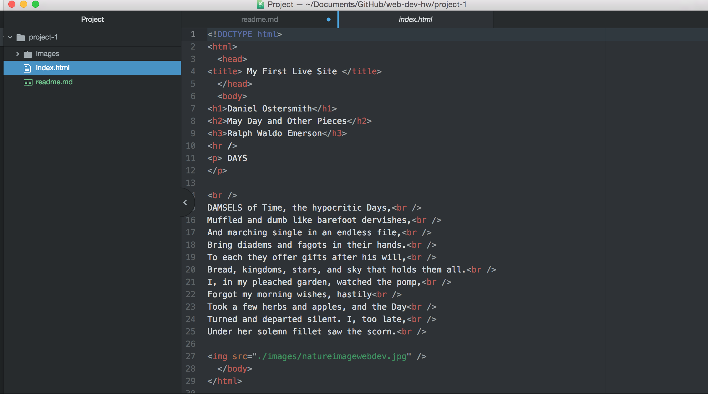

<h1>Technical Report For Project 1</h1>

 I primarily use Google Chrome to surf the web.

 Browsers work by interpreting content received
by servers and translate it in order to display this information on a web page.
Browsers utilize a user interface, a rendering engine, a browser engine that
communicates over a network, the programming language 'javascript' and the use
of data storage via 'cookies' and 'local storage'

I went to the United Airlines website on the Wayback Machine. I went to a
snapshot from May 2011 and saw a much more basic version of the site.
The site had similar options to enter your flight number and to look for flights,
but the layout was much more basic.
Today the sight has much crisper images and more interactive
buttons and drop down menus.

For this assignment I used and learned about html and how it differs in formatting
from markdown. I also got some more practice with pushing files to github.
I was a little confused on how to make my site live, but with persistence,
eventually figured it out.

